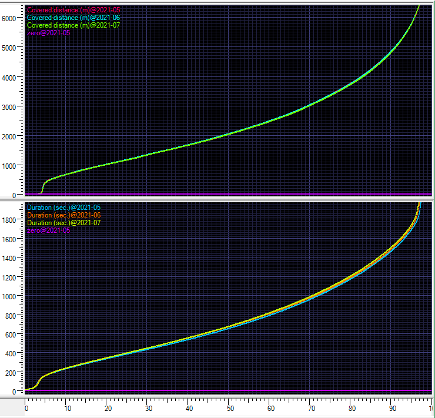

# Initial Data Review

## Introduction

Before starting to use the data and wildly start coding, let's first take a 
step back and see if there anything relevant we can learn about the data. The
assignment wisely calls for a data validation step while importing data into
the app and suggests dropping out any records for rides shorter than 10 meters.
Is that enough? Are there other validation steps that would make sense?

## Step 1: look at distributions

One thing I have found useful in the past is to plot the distributions 
of data; in the case of the bike ride data that applies to the distance and 
duration of the rides. So I calculated and visualized those "distrigrams" using
some tools that I had lying around. Normally I would not store images like this
in a GIT repository, but I think that in this case it is educational.

In case you haven't seen plots like this before: The X-axis shows the percentile
axis and the Y-axis the value for the variable (distance or duration, with
separate graph lines for each of the months). So you can easily read the median distance
and duration from the plots, for example: that's the value at 50. You can see that
the median distance for all three months is just above 2000m. And the median
duration is about 660 seconds.

One way to think about these plots are that they are simply all data samples
sorted by value, and then remapped to fit an X-axis running from 0 to 100.

So why show this plot? Well, there are some things visible that may inform what
a decent data validation stage could filter out. Under normal circumstances I
would suggest discussing these things with the customer, but I guess that in
this case I just have to make decisions by myself. Here are a few observations
and some conclusions I drew.

* Please note that I scaled the plots so you get a decent overview, but that means
some of the top and bottom gets cut off.
* The plots for the three data months are very similar. For the distance distribution
plots you can barely see that there are in fact three plots: they are mostly just
on top of each other.
* There is something suspicious going on at the start of the distributions.
    * For the distance, there are actual a handful of rows with "distance" being
    very large negative values (order of magnitude: 4000 km negative). It would
    make a good question to ask the customer about: is it just a bug? Some
    hardware issue? Hackers? No matter what, these values of course should not
    be taken into account.
    * Then there are quite many cases of "distance=0". The exercise instructions
    clearly state those should be skipped, as well as any other values below 10 m, 
    but I would like to understand what would be a good cutoff. What is exactly
    the purpose of the app? By dropping the "0 m" rides you forego the chance
    on providing insights on what exactly happens for those. And in reverse, if
    you want to gain insights based on "normal" data, isn't that 10m cutoff
    actually far too low? In the graph above you can see that the "main" part
    of the distribution only starts for rides above about 400m or so. 
    * Similar considerations can be applied to the low end of the "duration"
    distribution. One curiosity is that there fewer abnormal samples for 
    duration than for distance. If you want a safe "cut-off" for minimal
    duration of "normal" rides I would suggest 120 seconds.
* There are also suspicious things at the high end of the distributions as 
well, and I would suggest to include upper bounds for duration and distance.
    * Setting a duration cutoff at 4 hours (14400 seconds) would only exclude the
    top 0.30% of the rides, and most of those are probably not going to be
    representative of "normal" rides (and more cases of "oops, forgot to return").
    In fact, in the duration graph you can just see that there seems to be a 
    steepening of the graph already around 1800 seconds (30 minutes). If you
    would cut off there, you would still only exclude less than 5% of the rides.
    * Similarly for an upper distance cap - you would loose about 1% of the data
    by dropping any rides longer than 8000 m.
* In addition to these value bounds, there are also some other checks. In particular,
some distance value are just blank.

